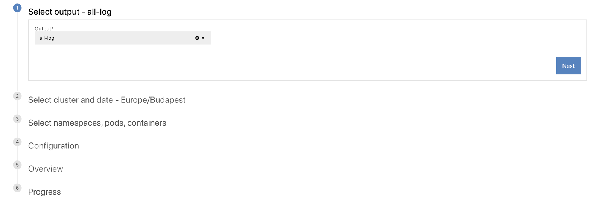
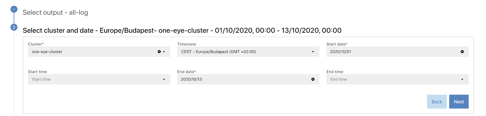
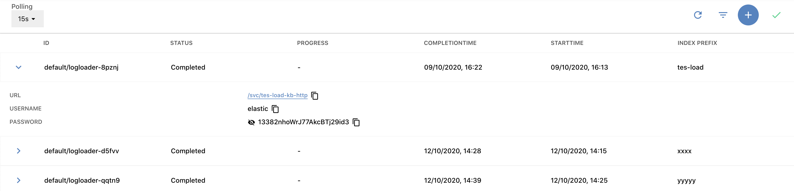

The **MENU > LOG RESTORATION** page allows you <!-- FIXME -->.

<!-- FIXME ## Prerequisites-->

## Restore logs

To restore archived log messages, complete the following steps.

1. Select **MENU > LOG RESTORATION**, then click .
    
1. Click . The Log Restoration Wizard opens.
    
1. Select the output from which you want to restore logs, then click **Next**.
1. Select the cluster and the time interval for which you want to restore logs.
    
1. To specify the details of the logs to be restored on the UI, select **Simple Builder**. Alternatively, you can select **Advanced Builder**, and specify the details in a JSON file.
1. To restore the logs of only specific namespaces, pod, and containers, search for the name of the respective resource, and select the ones you need. If you want to restore the logs of every resource, select **Any**. Note that searching for the resources returns only exact matches, unless you include the * wildcard.
    
1. <!-- FIXME -->
    
1. Before restoring the logs starts, review the settings of the process. If everything is as you intended, click **Next**.
    
1. One Eye starts restoring the logs. Depending on the amount of logs to restore, this can take a long time.
    
1. After the process is successfully completed, you can [access the restored logs](#access-logs).

## Access restored logs {#access-logs}

To tail your logs, or the logs that match a specific query in real-time, complete the following steps.

1. Open the One Eye web interface. <!-- FIXME link/xinclude az ingress connectre -->
1. Select **MENU > LOG RESTORATION**.
    
1. Click the ID of a set of logs. The access details of the logs is displayed.
    
1. Click the URL to open the Elasticsearch service where the logs are available, and use the username and password to access them (click the eye icon to display the password).
