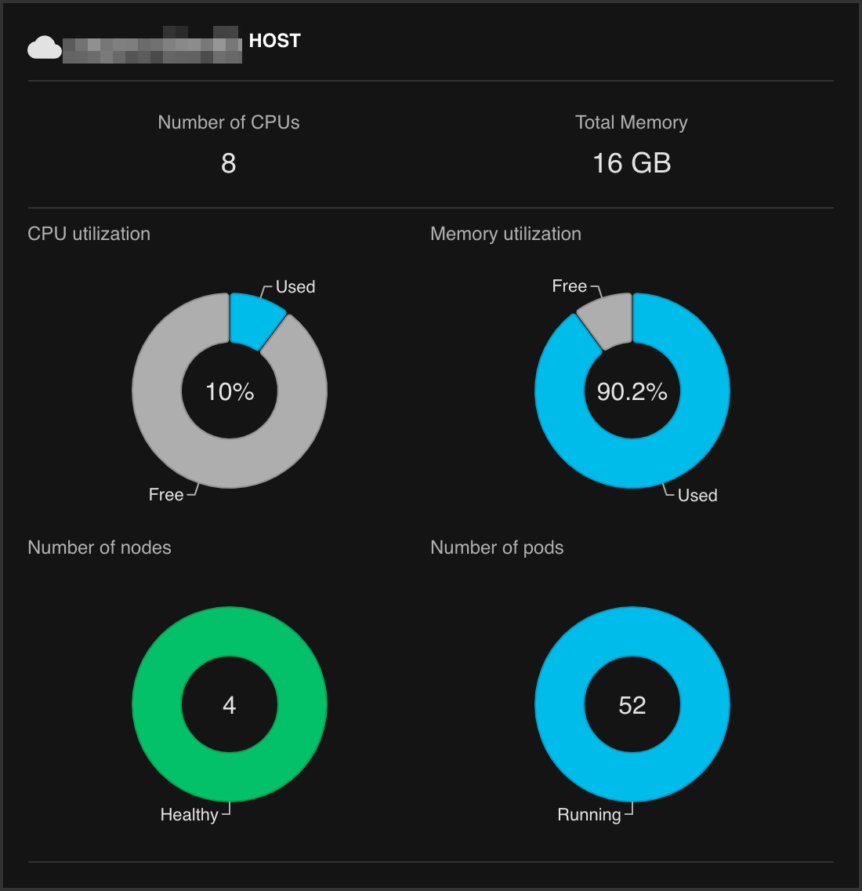

## Release 0.6 (2021-05-21) {#oe06}

### Rebranding

One Eye is now available as Cisco Multi Cloud Observability Manager.

### Host observer metrics

Metrics of the host observer cluster are displayed in the Topology view of the dashboard, independently from remote ThanosPeer clusters.

### Authentication improvements

Authentication now supports using custom Dex configurations as well. For details, see {}.

### Other improvements

- The operator now automatically upgrades its own Observer CRD
- The imagePullSecrets field is now added to all managed workloads
- Incorporate Thanos Operator CRDs into the chart
- ARM builds are now supported.

## Release 0.5 (2021-04-19) {#oe05}

One Eye allows you to attach multiple peer clusters to a central observer cluster to make your metrics available centrally, and store in object storage in a cost and storage-efficient way. One Eye automates several steps of connecting and maintaining the peer clusters, making it possible to operate your monitoring infrastructure with a low overhead. For details on how One Eye collects metrics from multiple clusters, see {}.

In version 0.5, you can secure One Eye access using an external ingress, and authenticate and authorize user connections. The solution is based on [Pomerium](https://github.com/pomerium/pomerium) and [Dex](https://github.com/dexidp/dex), allowing you to use the identity provider of your choice (for example, GitHub or LDAP). You can also apply role based authorization, and assign read-only or read and write access to One Eye.

## Release 0.4 (2020-12-03) {#oe04}

One Eye 0.4 brings the following significant new features:

- You can now easily restore archived logs into an Elasticsearch instance. For details, see {}.
- Search and display the collected metrics using the Prometheus PromQL query language directly on the One Eye interface. For details, see ().
- Promtail support.
- Fluentd (1.11.5), Fluent Bit (1.6.4), and plugin updates.
- Easier troubleshooting of [One Eye]() and the [Logging operator]().

For a more detailed overview of the new features, see the [One Eye 0.4 announcement blog post]().

## Release 0.3 (2020-06-25) {#oe03}

For an overview of the new features, see the [One Eye 0.3 announcement blog post]().
